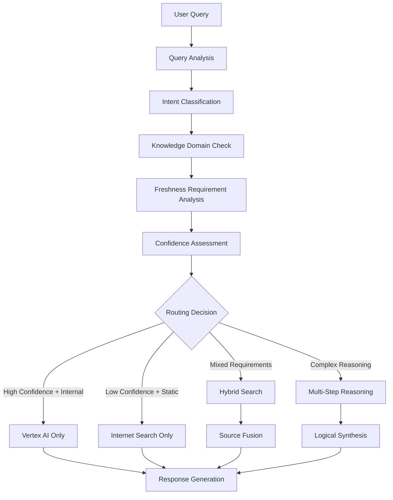

# Intelligent Multi-Source Routing System

## 🧠 System Overview

The Intelligent Multi-Source Routing System is the core intelligence engine that decides when to use:
- **Vertex AI Database** (internal knowledge)
- **Internet Search** (real-time information)
- **Hybrid Approach** (combined sources)
- **Reasoning Engine** (logical deduction)

## 🎯 Decision Engine Architecture

### Core Decision Matrix

```python
class IntelligentDecisionEngine:
    """
    Advanced decision engine that routes queries to optimal information sources
    """
    
    def __init__(self):
        self.confidence_threshold = 0.85
        self.freshness_weight = 0.3
        self.accuracy_weight = 0.4
        self.coverage_weight = 0.3
        
    def route_query(self, query: QueryContext) -> RoutingDecision:
        """
        Routes query to optimal information sources using multi-factor analysis
        """
        pass
```

### 🔄 Decision Flow



## 🧩 Routing Strategies

### 1. **Vertex AI Database Priority**
```python
class VertexAIStrategy:
    """Route to internal knowledge base when confident"""
    
    triggers = [
        "company_specific_products",
        "policy_details",
        "underwriting_guidelines",
        "internal_procedures",
        "document_references"
    ]
    
    confidence_requirements = {
        "entity_match": 0.9,        # Strong entity recognition
        "intent_clarity": 0.85,     # Clear intent classification
        "domain_coverage": 0.8      # Good domain coverage
    }
```

### 2. **Internet Search Priority**
```python
class InternetSearchStrategy:
    """Route to web search for real-time/external information"""
    
    triggers = [
        "current_market_rates",
        "industry_news",
        "regulatory_updates",
        "competitor_information",
        "economic_indicators",
        "recent_events",
        "general_knowledge"
    ]
    
    freshness_requirements = {
        "financial_data": "24_hours",
        "news_events": "6_hours", 
        "market_rates": "1_hour",
        "regulations": "30_days"
    }
```

### 3. **Hybrid Strategy**
```python
class HybridStrategy:
    """Combine multiple sources for comprehensive answers"""
    
    triggers = [
        "complex_comparisons",
        "market_analysis",
        "trend_analysis",
        "comprehensive_research",
        "fact_verification"
    ]
    
    fusion_methods = [
        "confidence_weighted_merge",
        "source_authority_ranking",
        "cross_validation",
        "temporal_prioritization"
    ]
```

### 4. **Reasoning Engine Strategy**
```python
class ReasoningStrategy:
    """Use logical reasoning for complex analytical queries"""
    
    triggers = [
        "multi_step_calculations",
        "scenario_analysis",
        "risk_assessment",
        "needs_analysis",
        "recommendation_generation"
    ]
    
    reasoning_types = [
        "mathematical_reasoning",
        "logical_deduction",
        "causal_inference",
        "comparative_analysis"
    ]
```

## 🚀 Implementation Architecture

### Core Components

#### 1. **Query Analyzer**
```python
class AdvancedQueryAnalyzer:
    """
    Analyzes queries for optimal routing decisions
    """
    
    def analyze_query(self, query: str) -> QueryContext:
        return QueryContext(
            intent=self.classify_intent(query),
            entities=self.extract_entities(query),
            complexity=self.assess_complexity(query),
            domain=self.identify_domain(query),
            freshness_need=self.assess_freshness_requirement(query),
            confidence_level=self.calculate_confidence(query),
            reasoning_type=self.identify_reasoning_type(query)
        )
    
    def classify_intent(self, query: str) -> IntentClassification:
        """Advanced intent classification with confidence scoring"""
        intents = {
            'factual_lookup': self._score_factual_intent(query),
            'comparison_analysis': self._score_comparison_intent(query),
            'calculation_request': self._score_calculation_intent(query),
            'recommendation_seeking': self._score_recommendation_intent(query),
            'trend_analysis': self._score_trend_intent(query),
            'current_information': self._score_current_info_intent(query)
        }
        
        best_intent = max(intents, key=intents.get)
        confidence = intents[best_intent]
        
        return IntentClassification(
            primary_intent=best_intent,
            confidence=confidence,
            all_scores=intents
        )
```

#### 2. **Source Evaluator**
```python
class SourceEvaluator:
    """
    Evaluates available sources for each query
    """
    
    def evaluate_vertex_ai(self, query_context: QueryContext) -> SourceEvaluation:
        """Evaluate Vertex AI suitability"""
        return SourceEvaluation(
            coverage_score=self._calculate_vertex_coverage(query_context),
            confidence_score=self._calculate_vertex_confidence(query_context),
            freshness_score=self._calculate_vertex_freshness(query_context),
            authority_score=0.95,  # High for internal documents
            cost_score=0.9         # Low cost for internal queries
        )
    
    def evaluate_internet_search(self, query_context: QueryContext) -> SourceEvaluation:
        """Evaluate internet search suitability"""
        return SourceEvaluation(
            coverage_score=self._calculate_web_coverage(query_context),
            confidence_score=self._calculate_web_confidence(query_context),
            freshness_score=0.95,  # High for real-time web data
            authority_score=self._calculate_web_authority(query_context),
            cost_score=0.7         # Higher cost for external APIs
        )
```

#### 3. **Decision Matrix**
```python
class DecisionMatrix:
    """
    Multi-criteria decision matrix for source selection
    """
    
    def calculate_source_scores(self, evaluations: Dict[str, SourceEvaluation], 
                               query_context: QueryContext) -> Dict[str, float]:
        """
        Calculate weighted scores for each source
        """
        weights = self._get_dynamic_weights(query_context)
        scores = {}
        
        for source, evaluation in evaluations.items():
            scores[source] = (
                evaluation.coverage_score * weights['coverage'] +
                evaluation.confidence_score * weights['confidence'] +
                evaluation.freshness_score * weights['freshness'] +
                evaluation.authority_score * weights['authority'] +
                evaluation.cost_score * weights['cost']
            )
        
        return scores
    
    def _get_dynamic_weights(self, query_context: QueryContext) -> Dict[str, float]:
        """Dynamic weight adjustment based on query characteristics"""
        base_weights = {
            'coverage': 0.25,
            'confidence': 0.25,
            'freshness': 0.20,
            'authority': 0.20,
            'cost': 0.10
        }
        
        # Adjust weights based on query type
        if query_context.intent.primary_intent == 'current_information':
            base_weights['freshness'] = 0.4
            base_weights['coverage'] = 0.2
        elif query_context.intent.primary_intent == 'factual_lookup':
            base_weights['authority'] = 0.35
            base_weights['confidence'] = 0.35
        
        return base_weights
```

#### 4. **Fusion Engine**
```python
class SourceFusionEngine:
    """
    Combines information from multiple sources intelligently
    """
    
    def fuse_sources(self, results: Dict[str, SearchResult], 
                    query_context: QueryContext) -> FusedResult:
        """
        Intelligent fusion of multiple source results
        """
        fusion_strategy = self._select_fusion_strategy(query_context)
        
        if fusion_strategy == 'confidence_weighted':
            return self._confidence_weighted_fusion(results)
        elif fusion_strategy == 'temporal_prioritized':
            return self._temporal_prioritized_fusion(results)
        elif fusion_strategy == 'authority_ranked':
            return self._authority_ranked_fusion(results)
        else:
            return self._balanced_fusion(results)
    
    def _confidence_weighted_fusion(self, results: Dict[str, SearchResult]) -> FusedResult:
        """Weight sources by confidence scores"""
        total_weight = sum(result.confidence for result in results.values())
        
        fused_content = []
        source_attributions = []
        
        for source, result in results.items():
            weight = result.confidence / total_weight
            weighted_content = self._weight_content(result.content, weight)
            fused_content.append(weighted_content)
            source_attributions.append({
                'source': source,
                'weight': weight,
                'confidence': result.confidence
            })
        
        return FusedResult(
            content=self._merge_content(fused_content),
            sources=source_attributions,
            overall_confidence=self._calculate_overall_confidence(results)
        )
```

## 🎯 Routing Decision Logic

### Decision Tree Structure

```python
class RoutingDecisionTree:
    """
    Decision tree for intelligent routing
    """
    
    def make_routing_decision(self, query_context: QueryContext) -> RoutingDecision:
        """
        Main decision logic using hierarchical decision tree
        """
        
        # Level 1: Intent-based initial routing
        if query_context.intent.primary_intent == 'current_information':
            if query_context.freshness_need == 'critical':
                return RoutingDecision(
                    strategy='internet_only',
                    confidence=0.9,
                    reasoning='Real-time information required'
                )
        
        # Level 2: Domain expertise assessment
        if query_context.domain == 'company_specific':
            vertex_coverage = self._assess_vertex_coverage(query_context)
            if vertex_coverage > 0.8:
                return RoutingDecision(
                    strategy='vertex_only',
                    confidence=vertex_coverage,
                    reasoning='High internal knowledge coverage'
                )
        
        # Level 3: Complexity-based routing
        if query_context.complexity == 'high':
            return RoutingDecision(
                strategy='hybrid_with_reasoning',
                confidence=0.85,
                reasoning='Complex query requires multiple sources and reasoning'
            )
        
        # Level 4: Confidence-based routing
        vertex_confidence = self._calculate_vertex_confidence(query_context)
        web_confidence = self._calculate_web_confidence(query_context)
        
        if vertex_confidence > 0.8 and web_confidence < 0.6:
            return RoutingDecision(
                strategy='vertex_primary',
                confidence=vertex_confidence,
                reasoning='High internal confidence, low web confidence'
            )
        
        # Default: Hybrid approach
        return RoutingDecision(
            strategy='hybrid_balanced',
            confidence=0.75,
            reasoning='Balanced approach for comprehensive coverage'
        )
```

## 📊 Performance Optimization

### Caching Strategy

```python
class IntelligentCaching:
    """
    Smart caching for routing decisions and results
    """
    
    def __init__(self):
        self.decision_cache = TTLCache(maxsize=1000, ttl=3600)
        self.result_cache = TTLCache(maxsize=500, ttl=1800)
        self.pattern_cache = TTLCache(maxsize=2000, ttl=7200)
    
    def cache_routing_decision(self, query_signature: str, decision: RoutingDecision):
        """Cache routing decisions for similar queries"""
        self.decision_cache[query_signature] = decision
    
    def get_cached_decision(self, query_signature: str) -> Optional[RoutingDecision]:
        """Retrieve cached routing decision"""
        return self.decision_cache.get(query_signature)
    
    def generate_query_signature(self, query_context: QueryContext) -> str:
        """Generate unique signature for query caching"""
        return hashlib.md5(
            f"{query_context.intent.primary_intent}:"
            f"{query_context.domain}:"
            f"{query_context.complexity}:"
            f"{query_context.freshness_need}".encode()
        ).hexdigest()
```

### Load Balancing

```python
class LoadBalancer:
    """
    Intelligent load balancing across sources
    """
    
    def __init__(self):
        self.source_loads = {
            'vertex_ai': LoadTracker(),
            'web_search': LoadTracker(),
            'reasoning_engine': LoadTracker()
        }
    
    def balance_load(self, routing_decision: RoutingDecision) -> RoutingDecision:
        """Adjust routing based on current load"""
        current_loads = {
            source: tracker.get_current_load() 
            for source, tracker in self.source_loads.items()
        }
        
        # If primary source is overloaded, suggest alternative
        if routing_decision.strategy == 'vertex_only':
            if current_loads['vertex_ai'] > 0.8:
                return self._suggest_alternative(routing_decision, current_loads)
        
        return routing_decision
```

## 🔮 Advanced Features

### 1. **Predictive Routing**
```python
class PredictiveRouter:
    """
    Predicts optimal routing based on historical patterns
    """
    
    def predict_optimal_route(self, query_context: QueryContext) -> PredictedRoute:
        """
        Use ML to predict best routing strategy
        """
        features = self._extract_features(query_context)
        prediction = self.routing_model.predict(features)
        
        return PredictedRoute(
            strategy=prediction.strategy,
            confidence=prediction.confidence,
            expected_performance=prediction.performance_metrics
        )
```

### 2. **Adaptive Learning**
```python
class AdaptiveRouter:
    """
    Learns from routing performance and adapts strategies
    """
    
    def learn_from_feedback(self, routing_decision: RoutingDecision, 
                           performance_metrics: PerformanceMetrics):
        """
        Update routing strategies based on performance feedback
        """
        # Update decision weights
        self._update_decision_weights(routing_decision, performance_metrics)
        
        # Retrain prediction models
        self._retrain_models_if_needed()
        
        # Update caching strategies
        self._optimize_caching_patterns()
```

### 3. **Context-Aware Routing**
```python
class ContextAwareRouter:
    """
    Routes based on user context and conversation history
    """
    
    def route_with_context(self, query_context: QueryContext, 
                          user_context: UserContext, 
                          conversation_history: ConversationHistory) -> RoutingDecision:
        """
        Make routing decision considering full context
        """
        # Analyze conversation patterns
        pattern_analysis = self._analyze_conversation_patterns(conversation_history)
        
        # Consider user preferences
        user_preferences = self._extract_user_preferences(user_context)
        
        # Adjust routing based on context
        base_decision = self.base_router.route(query_context)
        context_adjusted_decision = self._adjust_for_context(
            base_decision, pattern_analysis, user_preferences
        )
        
        return context_adjusted_decision
```

This intelligent routing system ensures that Clair provides the most accurate, up-to-date, and comprehensive answers by intelligently selecting and combining the best information sources for each unique query.